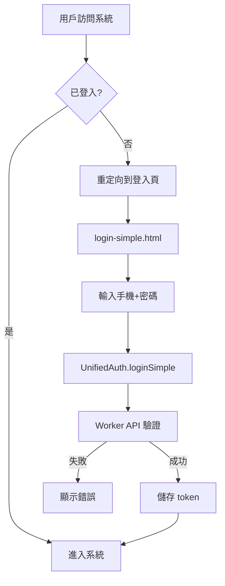

# 認證系統文件

## 系統概述

元心建材工程管理系統採用統一認證架構，支援多種認證方式，並可根據需求靈活切換。

## 當前認證方式

### 🚀 開發/測試環境 - 簡單認證 (login-simple.html)

**當前使用中的認證方式**

- **頁面**: `login-simple.html`
- **認證方式**: 手機號碼 + 末3碼密碼
- **後端 API**: `/api/v1/auth/login`

#### 測試帳號
```
管理員帳號 1:
手機: 0912345678
密碼: 678
名稱: 測試帳號
角色: admin

管理員帳號 2:
手機: 0963922033  
密碼: 033
名稱: 詹姆士
角色: admin
```

#### 使用方式
```javascript
// 使用統一認證系統登入
const result = await window.UnifiedAuth.loginSimple(phone, password);

if (result.success) {
    // 登入成功，跳轉到專案列表
    window.location.href = 'project-list.html';
} else {
    // 顯示錯誤訊息
    console.error(result.error);
}
```

---

## 未來認證方式

### 🔒 生產環境 - Clerk 認證 (待實施)

**準備就緒，可隨時切換**

- **需要時可建立**: `login-clerk.html`
- **認證方式**: Clerk 第三方認證服務
- **後端 API**: `/api/v1/auth/clerk/verify`

#### 切換步驟
1. 更新前端入口頁面連結
2. 設定 Clerk 相關環境變數
3. 測試 Clerk 認證流程

#### 使用方式
```javascript
// Clerk 認證登入
const result = await window.UnifiedAuth.loginClerk(clerkToken);

if (result.success) {
    // 認證成功
    window.location.href = 'project-list.html';
}
```

---

## 統一認證系統架構

### 核心組件

#### 1. UnifiedAuth 類別 (`js/unified-auth.js`)
```javascript
class UnifiedAuth {
    // 支援的認證方式
    AUTH_TYPES = {
        SIMPLE: 'simple',    // 簡單密碼認證 (當前使用)
        CLERK: 'clerk',      // Clerk 認證 (未來使用)
        EMERGENCY: 'emergency' // 緊急認證
    }
    
    // 認證方法
    loginSimple(phone, password)     // 簡單認證
    loginClerk(clerkToken)           // Clerk 認證
    loginEmergency(phone, code)      // 緊急認證
}
```

#### 2. 向後相容介面 (AuthUtils)
```javascript
window.AuthUtils = {
    getToken: () => window.UnifiedAuth.getToken(),
    getUser: () => window.UnifiedAuth.getUser(),
    isAuthenticated: () => window.UnifiedAuth.isAuthenticated(),
    logout: () => window.UnifiedAuth.logout(),
    // ... 其他方法
};
```

### 認證流程



---

## 檔案結構

### 認證相關檔案

```
frontend/
├── login-simple.html          # 當前使用 - 簡單認證頁面
├── project-list.html          # 專案列表
├── project-detail.html        # 專案詳情
├── project-create.html        # 專案建立 (已清理)
├── project-edit.html          # 專案編輯
├── cleanup-storage.html       # 儲存清理工具
├── setup-admin.html           # 管理員設定工具
├── js/
│   ├── unified-auth.js        # 統一認證系統
│   ├── auth-utils.js          # 向後相容介面
│   └── api-client.js          # API 客戶端
└── config.js                  # 系統配置

workers/
└── src/
    └── index.js               # Worker API (含認證邏輯)
```

### 頁面更新狀態

✅ **已更新為統一認證系統**:
- `login-simple.html`
- `project-list.html`
- `project-detail.html`  
- `project-create.html` (已清理重新命名)
- `project-edit.html`

🗑️ **已清理移除**:
- 舊版專案建立檔案 (v2, v3, d1)
- 測試檔案和規格檔案
- 舊版登入頁面
- 臨時和模板檔案

---

## API 端點

### 當前使用的認證端點

#### 簡單認證登入
```http
POST /api/v1/auth/login
Content-Type: application/json

{
  "phone": "0912345678",
  "password": "678"
}
```

#### Token 驗證
```http
GET /api/v1/auth/verify
Authorization: Bearer sess_xxx
```

### 預備認證端點

#### Clerk 認證
```http
POST /api/v1/auth/clerk/verify
Content-Type: application/json

{
  "token": "clerk_session_token"
}
```

#### 緊急認證 (生產環境停用)
```http
POST /api/v1/auth/emergency
Content-Type: application/json

{
  "phone": "emergency_phone",
  "code": "emergency_code"
}
```

---

## 環境設定

### 開發環境 (當前)
```javascript
CONFIG = {
    API: {
        WORKER_API_URL: 'https://construction-d1-api.lai-jameslai.workers.dev'
    },
    ENV: {
        ENVIRONMENT: 'development'
    }
}
```

### 生產環境 (Clerk 切換時)
```javascript
// 需要設定的環境變數
CLERK_PUBLISHABLE_KEY=pk_xxx
CLERK_SECRET_KEY=sk_xxx
ENABLE_CLERK_AUTH=true
```

---

## 切換到 Clerk 認證的步驟

### 1. 前端切換
```html
<!-- 當前 -->
<a href="login-simple.html">登入</a>

<!-- 切換後 -->
<a href="login-clerk.html">登入</a>
```

### 2. 更新主要頁面入口
- 更新 `index.html` 或主要導航
- 修改未登入重定向目標

### 3. 測試清單
- [ ] Clerk 登入流程
- [ ] Token 儲存與驗證
- [ ] 登出功能
- [ ] API 授權
- [ ] 錯誤處理

### 4. 部署順序
1. 更新 Worker 環境變數
2. 測試 Clerk API 端點
3. 更新前端頁面
4. 驗證完整流程

---

## 安全性特性

### ✅ 已實施
- 移除所有 demo token 邏輯
- 加強 token 驗證
- 自動處理 401 錯誤重定向
- localStorage 資料清理工具

### 🔒 安全建議
- 定期更換 API token
- 監控異常登入活動
- 設定 session 過期時間
- 啟用 HTTPS only cookies (生產環境)

---

## 疑難排解

### 常見問題

#### 1. 登入失敗
```bash
# 檢查 API 狀態
curl https://construction-d1-api.lai-jameslai.workers.dev/health

# 檢查認證端點
curl -X POST https://construction-d1-api.lai-jameslai.workers.dev/api/v1/auth/login \
  -H "Content-Type: application/json" \
  -d '{"phone":"0912345678","password":"678"}'
```

#### 2. Token 無效
- 使用 `cleanup-storage.html` 清理 localStorage
- 重新登入獲取新 token

#### 3. 頁面跳轉問題
- 檢查 `unified-auth.js` 載入順序
- 確認 `config.js` 正確載入

### 除錯工具
- **清理工具**: `cleanup-storage.html`
- **API 測試**: `setup-admin.html`
- **控制台日誌**: 開啟瀏覽器開發者工具

---

## 總結

當前系統使用簡單認證方式 (`login-simple.html`)，適合開發和測試環境。未來可無縫切換到 Clerk 認證系統，無需重寫核心邏輯，只需更改入口頁面和相關設定即可。

**切換時機建議**: 當需要更強的安全性、多因素認證、或整合其他服務時，再切換到 Clerk 認證系統。